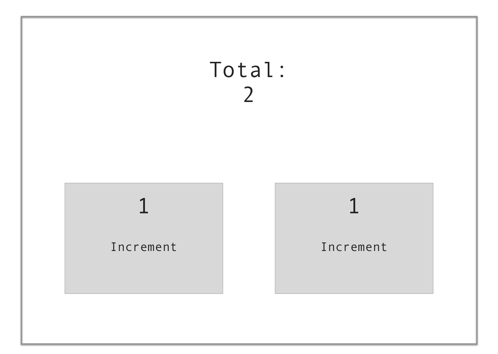

# React Quiz
Build the image below as a react app.  

### Specs
1. Each Increment button should increment by one
2. The increments should increment independently
3. The total of the two increments should be displayed in the top total

## Notes
+ Testing and state management decisions are yours
+ Bootstrap has been included to help with layout
+ Styles are loose

### Getting Started

* You'll need to have [git](https://git-scm.com/) and [node](https://nodejs.org/en/) installed in your system.
* Clone the project:

```
> $ git clone
```

Then install the dependencies:

```
> $ npm install
```

You can simply run webpack build using this command:

```
> $ npm run build
```

If you want to run with webpack-dev-server simply run this command:

```
> $ npm run dev
```

Open the web browser to `http://localhost:8888/`
